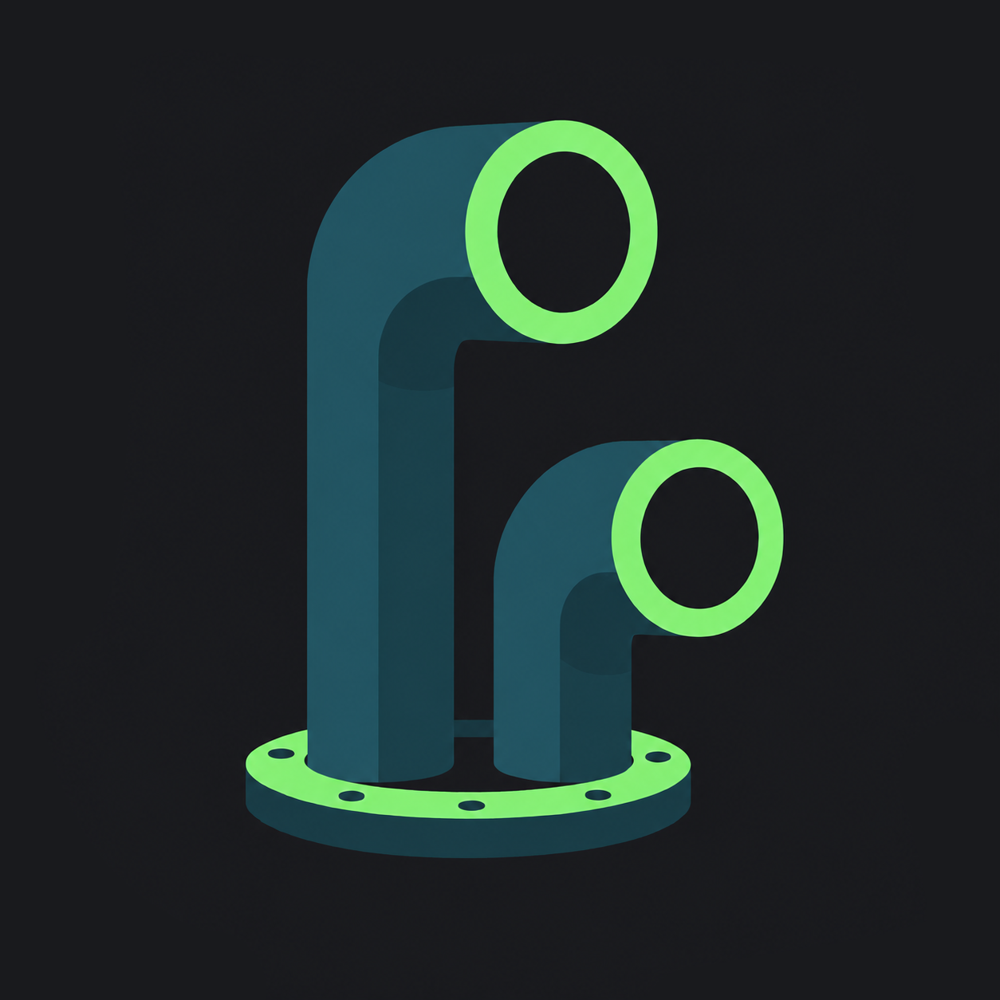

<div align="center">



# Scoutr

**A self-hosted Android control plane for coding agents running in Herdr.**

Watch agents, answer questions, steer sessions, open their terminal, and check usage without going back to your desk.

[Overview](#overview) · [Features](#features) · [Setup](#setup) · [Expose the bridge](#expose-the-bridge) · [Using Scoutr](#using-scoutr) · [Development](#development) · [Security](#security)

</div>

Scoutr keeps the agent runtime on your own machine. The Android app talks to a small local bridge over HTTPS/WSS; the bridge owns the Herdr socket and translates between the phone and live panes. There is no Scoutr account, hosted relay, or required subscription.

> [!NOTE]
> Scoutr is a remote supervision UI, not an agent runtime. `pi`, Claude Code, Antigravity/Gemini CLI, and Herdr still run on the host machine.

## Overview

```text
┌────────────────┐      HTTPS / WSS       ┌──────────────────┐
│ Android phone  │ ─────────────────────► │ scoutr-bridge    │
│ Scoutr app     │   Tailscale / CF /     │ 127.0.0.1:8737  │
└────────────────┘   reverse proxy        └────────┬─────────┘
                                                   │
                                             Unix socket
                                                   │
                                                   ▼
                                          ┌──────────────────┐
                                          │ Herdr            │
                                          │ workspaces/panes │
                                          └────────┬─────────┘
                                                   │
                                                   ▼
                                          pi / claude / agy
```

The repository has two main parts:

- [`bridge/`](./bridge) — Node/TypeScript daemon. It owns the Herdr Unix socket and exposes a bearer-token-authenticated HTTP/WebSocket API on loopback.
- [`android/`](./android) — native Kotlin + Jetpack Compose Android app.

Scoutr currently targets Herdr 0.8.0 / protocol 19. The Android app and bridge also have their own versioned API contract so an incompatible pair fails clearly instead of partially connecting.

## Features

- **Live board** — see which sessions need you, are working, are done, or are idle.
- **Attention from the board** — inspect pending questions and answer simple single-select asks without opening the full chat.
- **Agent chat and steering** — read transcripts, send prompts, answer structured questions, and use supported session controls.
- **New sessions** — pick a host folder and model, then launch a new agent inside a Herdr workspace.
- **Full-screen terminal** — open a Herdr pane from Android with terminal ownership and take-control handling.
- **Session history** — reopen persisted sessions even when their original pane is no longer live.
- **Provider usage** — inspect Codex, Claude, DeepSeek, xAI, and supported Antigravity usage from the host.
- **Push notifications** — optional Firebase Cloud Messaging push when an agent needs you; the ping carries no content, and the app fetches the detail from your bridge.
- **QR pairing** — pair the phone with the bridge without typing the host and token.
- **Remote app updates** — after the first install, the app can ask the host to build an APK, download it through the bridge, and hand it to Android's package installer.
- **No Scoutr cloud** — choose how the phone reaches the bridge: Tailscale, Cloudflare Tunnel, or your own reverse proxy.

## Setup

### 1. Host prerequisites

You need:

| Requirement | Notes |
|---|---|
| Herdr 0.8.0 | Must be running; default socket is `~/.config/herdr/herdr.sock` |
| Node.js 22+ | The bridge is tested with newer Node versions as well |
| An agent CLI | `pi`, Claude Code, and/or Antigravity/Gemini CLI depending on what you use |
| Git | Used by the build/version flow |
| Android tooling | Only required to build/install the app yourself |
| A Firebase project | Optional; only needed for push notifications |

Clone the repo and build the bridge:

```bash
git clone https://github.com/gdezan/scoutr.git
cd scoutr/bridge
npm ci
npm run build
npm test
npm run cli -- herdr status
```

The final command should be able to reach the local Herdr socket.

### 2. Start the bridge

Run it once in the foreground:

```bash
cd bridge
node dist/cli.js serve
```

On first start Scoutr creates `~/.config/scoutr/config.json` with mode `0600` and a random pairing token.

A minimal config looks like this:

```json
{
  "token": "scoutr_<random>",
  "port": 8737,
  "exposure": { "kind": "tailscale" }
}
```

The bridge always listens on loopback. Test it locally:

```bash
curl -s http://127.0.0.1:8737/api/health
# {"ok":false,"error":"unauthorized"}

TOKEN=$(python3 -c "import json;print(json.load(open('$HOME/.config/scoutr/config.json'))['token'])")
curl -s -H "Authorization: Bearer $TOKEN" http://127.0.0.1:8737/api/health
```

### 3. Keep the bridge running

Scoutr has one service helper for Linux and macOS. Run it from the repository root:

```bash
node scripts/bridge-service.mjs install
node scripts/bridge-service.mjs status --json
```

It installs and starts:

- a `systemd --user` service on Linux;
- a user LaunchAgent on macOS.

For Linux hosts that should keep running after logout:

```bash
loginctl enable-linger "$USER"
```

To rebuild and restart later:

```bash
scripts/deploy-bridge.sh
```

### 4. Claude question cards

`pi` exposes pending questions early enough for Scoutr to render them directly. Claude Code needs a small hook so open `AskUserQuestion` calls are visible before they are answered.

Install it once:

```bash
cd bridge
npm run build
node dist/cli.js install-claude-hook
```

Restart any Claude sessions that were already running after installing the hook.

## Expose the bridge

The phone needs an HTTPS URL that reaches `127.0.0.1:8737` on the host. Set `exposure.kind` to one of:

| Kind | Best for | `publicUrl` |
|---|---|---|
| `tailscale` | private access inside a tailnet | optional; normally discovered automatically |
| `cloudflare` | access from anywhere through your Cloudflare Tunnel | required, HTTPS only |
| `custom` | Caddy, nginx, Traefik, WireGuard/VPS, or another proxy you own | required; HTTPS for a physical phone |

Only the `tailscale` mode invokes the Tailscale binary. Cloudflare and custom exposure are externally owned: Scoutr only stores the URL it should advertise in the pairing QR.

### Tailscale

This is the simplest option when both the host and phone are on the same tailnet.

```bash
sudo tailscale set --operator="$USER"   # one time
tailscale serve --bg 8737
tailscale serve status
```

Config:

```json
{
  "exposure": { "kind": "tailscale" }
}
```

Scoutr discovers the host's Tailscale HTTPS name when pairing. Set `exposure.publicUrl` or `SCOUTR_PUBLIC_HOST` only when you need to override it.

### Cloudflare Tunnel

Use a named tunnel that you create and manage yourself. Scoutr does not read Cloudflare credentials or manage `cloudflared`.

Only the bridge needs a public hostname — push leaves the host through FCM, not through your proxy.

Example `cloudflared` ingress:

```yaml
tunnel: <tunnel-uuid-or-name>
credentials-file: /path/to/<tunnel-uuid>.json

ingress:
  - hostname: scoutr.example.com
    service: http://127.0.0.1:8737
  - service: http_status:404
```

Then configure Scoutr:

```json
{
  "token": "scoutr_<random>",
  "port": 8737,
  "exposure": {
    "kind": "cloudflare",
    "publicUrl": "https://scoutr.example.com"
  }
}
```

Restart the bridge and verify the public URL before pairing:

```bash
node scripts/bridge-service.mjs restart
curl -s https://scoutr.example.com/api/health
curl -s -H "Authorization: Bearer $TOKEN" https://scoutr.example.com/api/health
```

> [!IMPORTANT]
> A Cloudflare or custom hostname can be Internet-routable. Scoutr does not add Cloudflare Access or another identity layer for you. Read [Security](#security) before exposing it publicly.

### Custom

Use `custom` when you already operate the reverse proxy or private network path.

```json
{
  "exposure": {
    "kind": "custom",
    "publicUrl": "https://scoutr.example.com"
  }
}
```

The proxy must:

- forward the bridge hostname to `http://127.0.0.1:8737`;
- preserve the `Authorization` header;
- support WebSocket upgrades for terminal/topology sockets;
- terminate TLS for a physical Android device.

`http://` is allowed for explicit development setups, such as an emulator talking to the host. Android release builds expect HTTPS.

#### Caddy

Caddy is a small custom-exposure setup when it runs on the same host as Scoutr. Point DNS for the names you want to use at that host and make ports 80/443 reachable so Caddy can obtain certificates automatically.

Install Caddy using the package for your OS, then edit its Caddyfile. A common Linux package install uses `/etc/caddy/Caddyfile`:

```caddyfile
scoutr.example.com {
    reverse_proxy 127.0.0.1:8737
}
```

Caddy's `reverse_proxy` handles WebSocket upgrades and forwards normal incoming headers, including `Authorization`, so Scoutr needs no special WebSocket/header rules.

Validate and reload the config when Caddy is running as a system service:

```bash
sudo caddy validate --config /etc/caddy/Caddyfile
sudo systemctl reload caddy
```

Set the matching Scoutr config:

```json
{
  "token": "scoutr_<random>",
  "port": 8737,
  "exposure": {
    "kind": "custom",
    "publicUrl": "https://scoutr.example.com"
  }
}
```

Restart the bridge and verify Caddy before generating the QR:

```bash
node scripts/bridge-service.mjs restart

curl -s https://scoutr.example.com/api/health
# unauthorized is expected without the token

curl -s -H "Authorization: Bearer $TOKEN" https://scoutr.example.com/api/health

cd bridge
node dist/cli.js pair
```

If Caddy runs on another machine, `127.0.0.1` is the wrong upstream. Route Caddy to the Scoutr host over a network path you trust instead.

## Optional: push notifications

Scoutr can push a notification to your phone the moment an agent blocks, even
when the app is closed. It uses Firebase Cloud Messaging as a wake-up bell
only: the message contains nothing but a pane id, and the app fetches the
agent's name and workspace from your own bridge. No notification text ever
reaches Google. See `docs/adr/0007-fcm-contentless-push.md` for why.

This needs a Firebase project of your own — it holds nothing but FCM
credentials:

1. Create a project at [console.firebase.google.com](https://console.firebase.google.com).
2. Add an Android app with the package name `dev.scoutr.app`, and download
   `google-services.json` into `android/app/`. It ships inside your APK and is
   not a secret, but it is gitignored because it is per-developer.
3. Project settings → Service accounts → **Generate new private key**. Save it
   as `~/.config/scoutr/fcm-service-account.json` and `chmod 600` it. This one
   *is* a secret: it can send push to your devices.
4. Point the bridge at it:

```json
{
  "fcmServiceAccountPath": "/home/<you>/.config/scoutr/fcm-service-account.json"
}
```

Restart the bridge and rebuild the app. `GET /api/health` reports
`"push": { "fcm": true }` when the key loaded. Without it the bridge logs one
warning at startup and everything else works exactly as before — you simply
get no notifications.

Push notifications require Google Play Services on the phone.

## Build and install the Android app

Scoutr is not distributed through the Play Store. The first install uses an APK you build from the repository.

The app requires Android 8.0 / API 26 or newer. Building it requires JDK 17 and Android SDK 36.

Example toolchain setup with mise:

```bash
mise install java@17
mise use -g java@17
export JAVA_HOME=$(mise where java@17)
export ANDROID_HOME=$HOME/Android/sdk

yes | sdkmanager --licenses
sdkmanager \
  "platform-tools" \
  "emulator" \
  "platforms;android-36" \
  "build-tools;36.0.0" \
  "system-images;android-36;google_apis;x86_64"
```

Build the debug APK:

```bash
make build
# android/app/build/outputs/apk/debug/app-debug.apk
```

Install it on a connected device:

```bash
make install
```

`scripts/install-app.sh` automatically uses the only connected ADB target. With multiple devices it lets you choose one, or you can pass `--serial <serial>`.

### Emulator

For local development, the Android emulator can reach the host loopback at `10.0.2.2`:

```text
Bridge address: http://10.0.2.2:8737
Pairing token:  value from ~/.config/scoutr/config.json
```

Debug builds allow this cleartext development connection. Use HTTPS on a physical phone.

## Pair the phone

With the bridge built and its public URL working:

```bash
scripts/pair.sh
```

Or directly:

```bash
cd bridge
node dist/cli.js pair
```

In the Android app choose **Scan QR code**. You can also enter the bridge URL and token manually.

Pairing payloads are versioned:

- Tailscale uses the original v1 payload.
- Cloudflare/custom use v2 and include the exposure kind.

If an older APK rejects a v2 QR, update the app instead of changing the QR by hand.

## Using Scoutr

### Board

The board groups sessions by attention state and refreshes against the bridge. Tap a session to open it. Simple pending questions can expose quick-answer actions directly on the card.

### New session

Use the add button to choose a host folder and supported model. Scoutr creates or reuses the appropriate Herdr workspace, starts the agent in a pane, and opens the session.

### Chat

Chat reads the agent's real persisted transcript and sends commands back through the live pane. Depending on the backend, Scoutr supports controls such as abort, retry, compact, fork, rename, model changes, and thinking changes.

### Terminal

Open the terminal from the top bar or a session. Scoutr renders one Herdr pane full-screen through the bridge's terminal WebSocket. If another controller owns a pane, Scoutr opens it read-only until you explicitly take control.

See [`docs/terminal.md`](./docs/terminal.md) for the terminal ownership and lifecycle contract.

### Usage

The usage screen reads supported provider state from the host and shows quota windows, balances, or credits when the corresponding credentials exist.

### Updates

After the initial ADB install, **Settings → Update** can build the current APK on the host, download it through the existing bridge connection, and open Android's package installer. Android still requires the user to approve the install.

## Configuration

The main bridge config is `~/.config/scoutr/config.json` or `$XDG_CONFIG_HOME/scoutr/config.json`.

| Setting / environment variable | Purpose |
|---|---|
| `port` | Bridge loopback port; default `8737` |
| `token` | Bearer token used by Android |
| `exposure.kind` | `tailscale`, `cloudflare`, or `custom` |
| `exposure.publicUrl` | Public bridge base URL; required for Cloudflare/custom |
| `fcmServiceAccountPath` | Optional path to the Firebase service-account JSON; enables push |
| `HERDR_SOCKET_PATH` | Override the Herdr Unix socket path |
| `SCOUTR_REPO_ROOTS` | Allow-list roots for repository/review access |
| `PI_CODING_AGENT_DIR` | pi data directory used for sessions/models/usage |
| `PI_CODING_AGENT_SESSION_DIR` | Override pi's session directory |
| `CLAUDECONFIGDIR` | Override Claude's config directory |
| `PI_BIN` | Override the pi executable path |
| `PI_NODE_BIN` | Override Node used to run pi |
| `SCOUTR_PUBLIC_HOST` | Fallback/override public bridge URL used for pairing |
| `SCOUTR_ANTIGRAVITY_CLIENTS` | JSON array of Antigravity OAuth clients kept outside the repo |

A legacy top-level `publicHost` value is migrated into the newer exposure config on startup.

## Development

Useful commands from the repository root:

```bash
make help
make build          # Android debug APK
make install        # build + install APK
make release        # deploy bridge + build + install APK
make deploy-bridge  # rebuild + restart supervised bridge
make bridge-test    # TypeScript typecheck + bridge tests
make android-test   # Android JVM unit tests
make verify         # full repository verification script
```

Direct scripts:

```bash
scripts/deploy-bridge.sh
scripts/pair.sh
scripts/install-app.sh
scripts/release.sh

node scripts/bridge-service.mjs install
node scripts/bridge-service.mjs restart
node scripts/bridge-service.mjs status --json
```

> [!TIP]
> Repository development has a deliberate verification boundary: use cheap targeted checks during implementation and review, then run emulator/integration/E2E acceptance only after the code is review-clean and frozen. See [`AGENTS.md`](./AGENTS.md) and [`skills/scoutr-verification/SKILL.md`](./skills/scoutr-verification/SKILL.md).

More development details live in [`docs/dev-workflow.md`](./docs/dev-workflow.md).

## API compatibility

The Android-to-bridge API protocol is separate from both the Scoutr app version and the Herdr protocol.

`/api/health` advertises the bridge protocol and feature names. The app accepts only its supported range. If a bridge/app mismatch is detected, Scoutr blocks feature traffic but keeps the saved pairing so deploying a compatible build can recover it.

Additive optional fields stay on the current protocol. Removing or renaming required fields, changing required semantics, or requiring new command/response behavior requires a protocol bump on both sides.

## Security

- The Herdr socket is never exposed directly. Only the local bridge opens it.
- The bridge itself binds to loopback and requires the bearer token before serving API routes or WebSocket upgrades.
- Tailscale mode adds tailnet reachability on top of the application token.
- Cloudflare/custom mode may put the bridge on the public Internet. Scoutr does not automatically add Cloudflare Access, mTLS, device posture, or another identity provider.
- The pairing QR contains credentials. Treat a leaked QR or token as a credential compromise and rotate it.
- Push carries no content. The FCM message names a pane and nothing else, so notification text never leaves your host. Keep `fcm-service-account.json` at mode `0600`: it can send push to your paired devices.
- Android stores the saved bridge token encrypted with Android Keystore-backed AES-GCM.

To rotate the Scoutr token without resetting the rest of the config:

```bash
python3 - <<'PY'
import base64
import json
import os
import pathlib
import secrets

p = pathlib.Path.home() / ".config/scoutr/config.json"
c = json.loads(p.read_text())
b64 = lambda n: base64.urlsafe_b64encode(secrets.token_bytes(n)).rstrip(b"=").decode()

c["token"] = "scoutr_" + b64(18)

p.write_text(json.dumps(c, indent=2) + "\n")
os.chmod(p, 0o600)
PY

node scripts/bridge-service.mjs restart
scripts/pair.sh
```

Re-pair every phone after rotating credentials.

## Troubleshooting

| Symptom | What to check |
|---|---|
| Bridge cannot reach Herdr | `herdr --version`, Herdr service state, and `HERDR_SOCKET_PATH` |
| Supervised bridge exits immediately | service definition must use an absolute Node path; rerun `node scripts/bridge-service.mjs install` |
| Local health works but public URL times out | debug Tailscale, `cloudflared`, Caddy, DNS, firewall, or the custom network path separately |
| Public URL returns 401 | expected without `Authorization: Bearer <token>`; verify the phone has the current token |
| `pair` says there is no public URL | set `exposure.publicUrl` for `cloudflare`/`custom`, or fix Tailscale discovery |
| v2 QR is rejected | update the Android app to a build that supports Cloudflare/custom pairing |
| No push notifications arrive | check `/api/health` reports `"push": {"fcm": true}`, that the phone has Google Play Services, and that Android's notification permission is granted |
| App stays disconnected after a bridge restart | verify the bridge and exposure URL; the board should recover once the endpoint is reachable |
| Stale bridge behavior after code changes | rebuild before restart: `scripts/deploy-bridge.sh` |

For deeper host, bridge, emulator, and tunnel diagnostics, see [`docs/dev-workflow.md`](./docs/dev-workflow.md).

## Known limits

- One bridge/host per app installation; multi-host pairing is future work.
- Terminal ownership and lifetime have explicit constraints documented in [`docs/terminal.md`](./docs/terminal.md).
- Backend capabilities differ. Claude and Antigravity do not expose every control/model/session behavior that pi does.
- Time-in-state depends on agent lifecycle events being available from Herdr.
- Push requires Google Play Services; a de-Googled device gets no notifications.

## Project docs

- [`PRODUCT.md`](./PRODUCT.md) — product intent and constraints
- [`docs/decisions.md`](./docs/decisions.md) — architectural/product decisions
- [`docs/dev-workflow.md`](./docs/dev-workflow.md) — development, deployment, and diagnostics
- [`docs/terminal.md`](./docs/terminal.md) — terminal architecture and ownership
- [`android/app/src/main/java/dev/scoutr/app/ui/theme/DESIGN.md`](./android/app/src/main/java/dev/scoutr/app/ui/theme/DESIGN.md) — Android design system
- [`AGENTS.md`](./AGENTS.md) — repository instructions for coding agents
